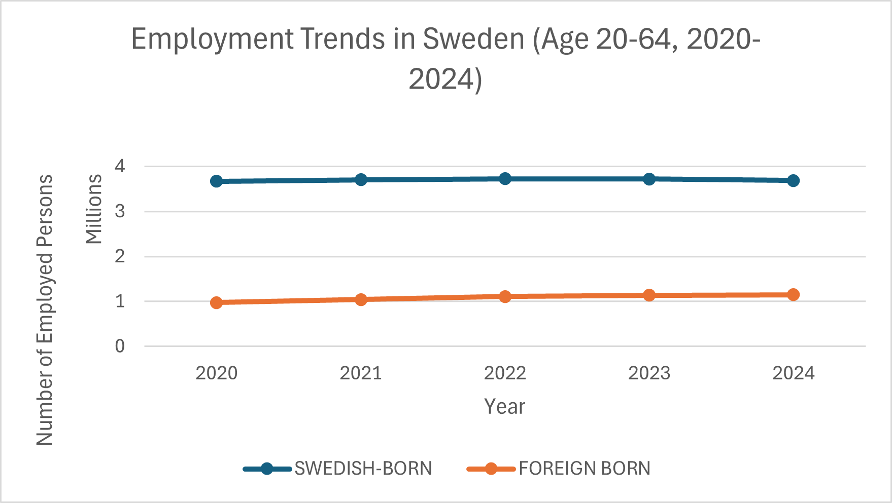
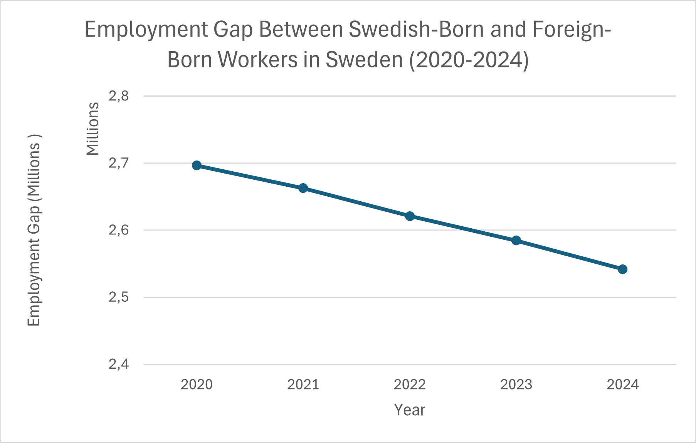

# Sweden-Employment-Analysis (2020-2024)
## Project Overview
This project analyzes employment trends in Sweden between 2020 and 2024 for individuals aged 20–64.
The analysis compares employment levels between two population groups:
- Swedish-born individuals
- Foreign-born individuals
The objective is to understand how employment levels have changed over time and to examine the employment gap between these groups.

## Dataset
The data used in this project comes from Statistics Sweden (SCB).

Variables included:
- Year
- Number of employed Swedish-born persons
- Number of employed foreign-born persons

## Tools Used
- Microsoft Excel
- Mircosoft Power BI
- Data visualization 
- Trend analysis

## Visualization
The chart below illustrates employment trends in Sweden between 2020 and 2024 for Swedish-born and Foreign-born individuals aged 20-64.

# Sweden Employment Analysis

## Project Overview
This project analyzes employment trends in Sweden between 2020 and 2024 for individuals aged 20–64.

The analysis compares two groups:
- Swedish-born individuals
- Foreign-born individuals

The goal is to understand how employment levels have changed over time and whether differences exist between these population groups.

## Dataset
The data used in this project comes from Statistics Sweden (SCB).

Variables included:
- Year
- Number of employed Swedish-born persons
- Number of employed foreign-born persons

## Tools Used
- Microsoft Excel
- Data visualization using line charts

## Visualization
The chart below shows employment trends between 2020 and 2024.

## Key Insight
Employment among Swedish-born individuals remains significantly higher than among foreign-born individuals. However, the data indicates a gradual reduction in the employment gap between the two groups from 2020 to 2024.
This trend suggests a modest improvement in labour market integration for foreign-born individuals in Sweden during the observed period.

Source: Statistics Sweden (SCB), Labour Market Statistics.

---

## Dashboard Preview

### Employment Trend

### Employment Gap

---

## Key Insight

Employment among Swedish-born individuals remains consistently higher than among foreign-born individuals. However, the data shows a gradual reduction in the employment gap between the two groups from 2020 to 2024, suggesting modest improvements in labour market integration.

---

## Data Source

Statistics Sweden (SCB) – Labour Market Statistics

## Author

**Theresa Catherine Appiah, MD**

Global Health & Data Analytics Enthusiast

Co-Founder, Integrate360 Consult

Research interests include migration, labour market integration, and public health data analysis.

LinkedIn: https://www.linkedin.com/in/theresa-catherine-appiah-md-hso-mhart-5aa58936
